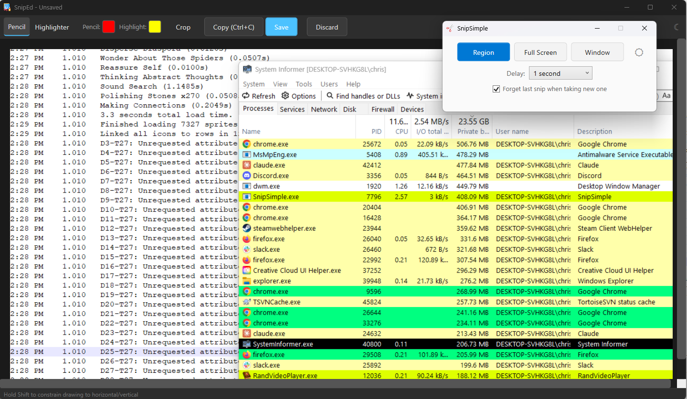

# SnipSimple

The snipping tool has always been a key part of my workflow, especially for being able to look at small parts of the screen and quickly edit them. Unfortunately, the Windows 11 version of the concept really has a lot of features that go backwards in terms of usability (auto-saving snips by default, inability to set 1 or 2 second delays, delay settings forgotten after one use, and the list goes on).

Since that was the case, I decided to go ahead and make a tool that has the essential features that I use in my daily use, as well as including several other quality of life features I always wished for. I commonly save snips in one of a few folders, and so this remembers your recent folders and lets you save to them quickly. It also allows you to keep older snips visible without replacing them if you want. And it has undo/redo functions when you're doing quick markup on a snip. Even in the Windows 10 version, I would often accidentally make a mark that I could not undo.

This is one of those things for my own daily workflow, but hopefully you also find it useful!

---



---

## What Is This?

SnipSimple is a lightweight Windows screen capture and annotation tool built with WPF/.NET 8. It recreates the essential workflow of the classic Windows 10 Snipping Tool with a few quality-of-life improvements, while staying fast and minimal.

## Features

### Capture Modes

| Mode | Description |
|------|-------------|
| **Region** | Click and drag a rectangle on a fullscreen overlay. Dark mask shows what's outside the selection. Dimensions display while dragging. |
| **Full Screen** | Captures all monitors in a single image. |
| **Window** | Hover over windows to highlight them with a blue border, then click to capture. Uses DWM extended frame bounds for pixel-accurate sizing. |

### Delay Timer

A dropdown on the main window lets you set a capture delay: **No delay** (default), **1**, **2**, **3**, **4**, **5**, or **10 seconds**. A floating countdown overlay appears during the delay. All windows (including the editor) hide during the countdown so they don't appear in the capture.

### Editor (SnipEd)

After every capture, the image is automatically copied to the clipboard and opened in the editor. The editor provides:

- **Pencil tool** - Freehand drawing. Default color: red (configurable). 3px round tip.
- **Highlighter tool** - Semi-transparent highlighting. Default color: yellow (configurable). Square tip with configurable size.
  - **Ctrl+Mouse Wheel** adjusts the highlighter size (8px to 80px).
  - A square cursor previews the highlighter size and color.
- **Shift+Drag** draws a perfectly straight line constrained to horizontal or vertical axis. A live preview line shows exactly where the stroke will land before you release. Axis locks after 3px of movement in either direction.
- **Crop tool** - Click and drag to define a crop region. Visual guides include:
  - Dark overlay masking the area outside the selection
  - Dashed blue selection border
  - Rule-of-thirds grid lines
  - Dimension label (W x H)
  - Crops are **undoable** via Ctrl+Z.
- **Undo / Redo** - Ctrl+Z undoes strokes first, then crops. Ctrl+Shift+Z redoes.
- **Copy** (Ctrl+C) - Re-copies the current image with all annotations to the clipboard at any time.
- **Save** - Opens a dropdown of recent save locations. Each option opens the native file dialog pre-navigated to that folder, so you can name the file and choose the format. "Different location..." opens a blank dialog.
  - Folders are displayed with smart naming: well-known folders (Pictures, Desktop, etc.) show just the name; others show `Parent\Folder` for context.

### Save Locations

SnipSimple remembers up to 10 recent save folders. Clicking any of them opens the system Save dialog pointed at that folder, ready for you to type a filename and pick a format (PNG, JPG, BMP).

### Dark / Light Theme

Both the main window and the editor have a small sun/moon toggle button:

- **Main window** defaults to **light** theme.
- **Editor** defaults to **dark** theme (including the Windows title bar and scrollbars).

Click the toggle to switch. The title bar color updates instantly via DWM.

### Forget Last Snip

A checkbox on the main window: **"Forget last snip when taking new one"** (default: on). When checked, starting a new capture closes the previous editor. When unchecked, old editors stay open so you can accumulate multiple snips.

### Global Hotkey

**Win+Shift+S** triggers a region capture from anywhere. This is intercepted via a low-level keyboard hook that suppresses the default Windows 11 Snipping Tool when SnipSimple is running.

## Keyboard Shortcuts

| Shortcut | Context | Action |
|----------|---------|--------|
| **Win+Shift+S** | Global | Start region capture |
| **Escape** | During capture | Cancel capture |
| **Ctrl+C** | Editor | Copy image + annotations to clipboard |
| **Ctrl+S** | Editor | Open save location menu |
| **Ctrl+Z** | Editor | Undo (strokes first, then crops) |
| **Ctrl+Shift+Z** | Editor | Redo |
| **Shift+Drag** | Editor | Draw constrained straight line (H or V) |
| **Ctrl+Scroll** | Editor (highlighter) | Adjust highlighter size |

## Settings

Settings are stored in `%APPDATA%\ArcenSettings\SimpleSnip\`:

### `settings.json`
Preferences that are relatively stable:
```json
{
  "pencilColor": "#FF0000",
  "highlighterColor": "#FFFF00",
  "recentSaveLocations": [
    "C:\\Users\\you\\Pictures",
    "C:\\Users\\you\\Projects\\Screenshots"
  ]
}
```

### `user-settings.json`
Data that changes frequently:
```json
{
  "lastSaveLocation": "C:\\Users\\you\\Pictures"
}
```

Both files are auto-created on first run with sensible defaults (red pencil, yellow highlighter, Pictures folder).

## Building

### Prerequisites
- [.NET 8 SDK](https://dotnet.microsoft.com/download/dotnet/8.0) (Windows)

### Build
```bash
dotnet build src/SnipSimple/SnipSimple.csproj
```

### Run
```bash
dotnet run --project src/SnipSimple/SnipSimple.csproj
```

### Publish (self-contained)
```bash
dotnet publish src/SnipSimple/SnipSimple.csproj -c Release -r win-x64 --self-contained
```

## Project Structure

```
src/SnipSimple/
  App.xaml/.cs                  - Application entry point, resource dictionaries
  GlobalUsings.cs               - Resolves WPF/WinForms type ambiguities
  Models/
    AppSettings.cs              - Settings + UserSettings POCOs
    CaptureResult.cs            - Captured image + metadata
    SnipMode.cs                 - Region / FullScreen / Window enum
  Services/
    ScreenCaptureService.cs     - Win32 BitBlt/PrintWindow screen capture
    SettingsService.cs          - JSON settings load/save (two files)
    ClipboardService.cs         - Clipboard operations
    HotkeyService.cs            - Low-level keyboard hook for Win+Shift+S
    ThemeService.cs             - Light/dark theme switching + DWM title bar
  Views/
    MainWindow.xaml/.cs         - Launcher (mode buttons, delay, options)
    EditorWindow.xaml/.cs       - Annotation editor (pencil, highlighter, crop)
    OverlayWindow.xaml/.cs      - Fullscreen capture overlay (region + window)
    CountdownWindow.xaml/.cs    - Delay countdown overlay
  Helpers/
    NativeMethods.cs            - Win32 P/Invoke declarations
    WindowEnumerator.cs         - EnumWindows helper for window capture
    BitmapHelper.cs             - GDI/WPF bitmap conversions
  Converters/
    BoolToVisibilityConverter.cs
  Resources/
    Styles.xaml                 - Shared button/toggle styles (DynamicResource)
    ThemeLight.xaml              - Light theme color definitions
    ThemeDark.xaml               - Dark theme colors + dark scrollbar styles
    Icons/
      scissors.png              - Main window icon
      editor.png                - Editor window icon
```

## License

MIT License. See [LICENSE](LICENSE) for details.
